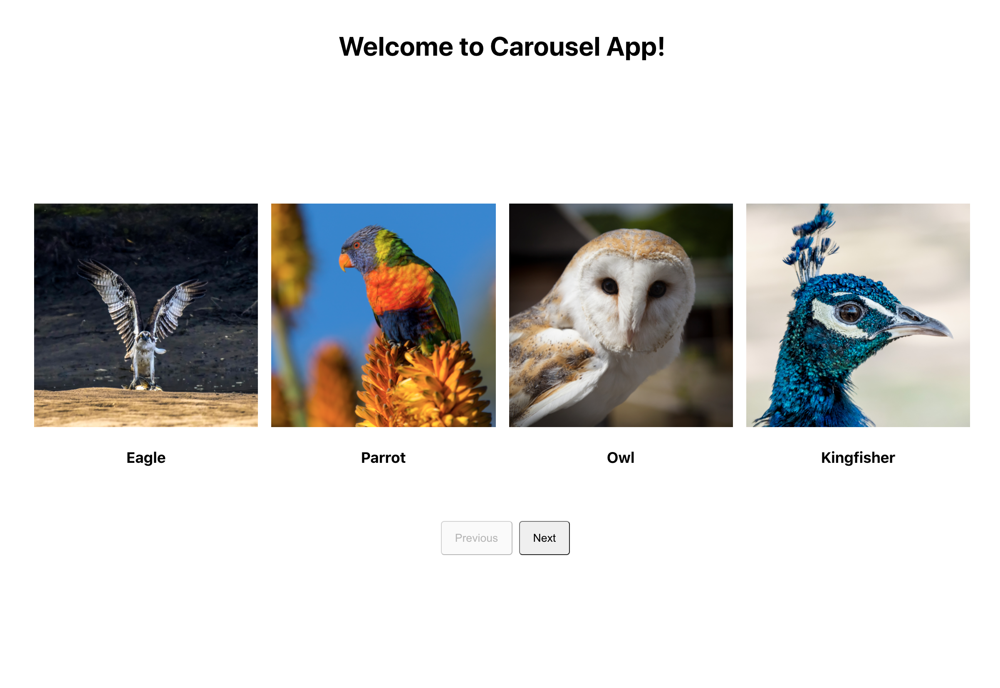
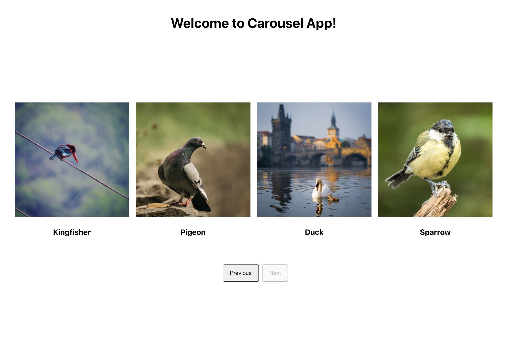
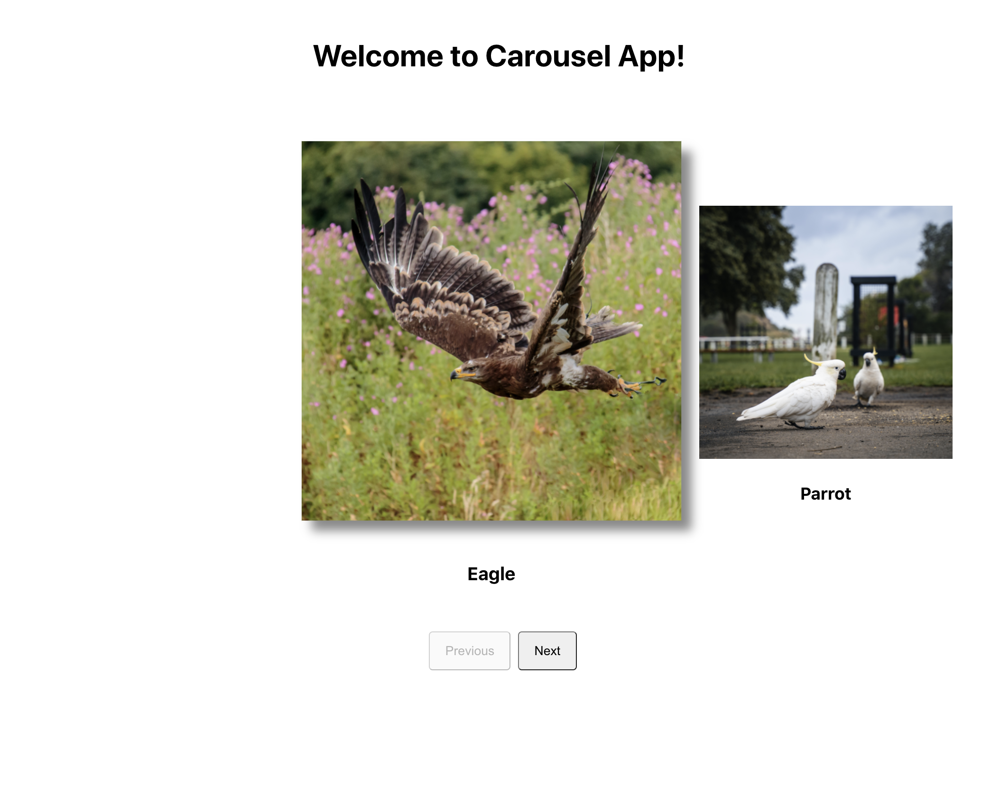
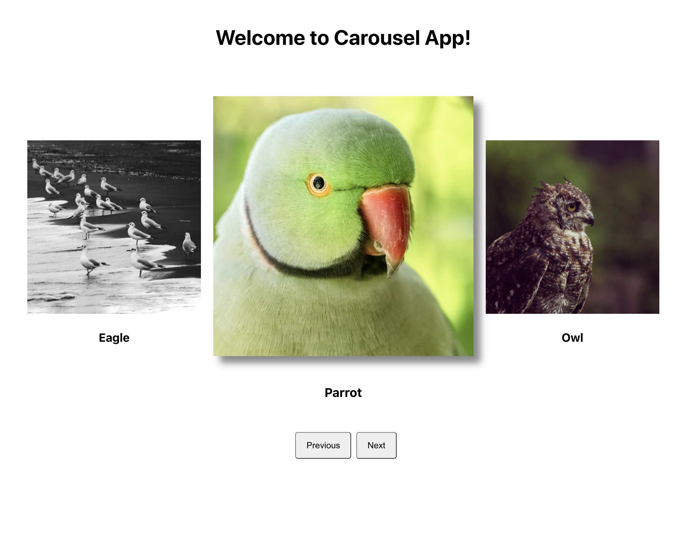
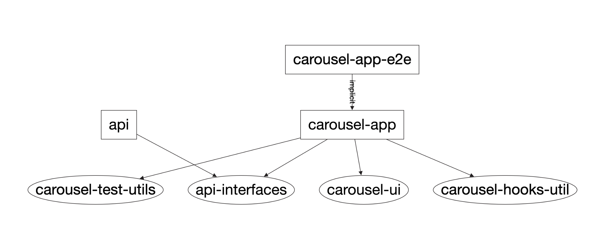

# CarouselApp

Application that displays image carousel. By default this will display four blocks that contain image and its description. Number of blocks value is configurable(i.e 3 OR 4), to be passed as prop to [ImageCarousel](./libs/carousel/ui/src/lib/image-carousel/image-carousel.tsx) component

`with 4 blocks`:

<p float="left">


</p>

`with 3 blocks`:

<p float="left">


</p>

## Installation

Navigate to the root directory and install the dependencies

```
# Please make sure you have node environment setup. This project uses node v14.14.0

cd carousel-app
yarn install
```

## Project structure



This app is a monorepo bootstraped using [nx.dev](https://nx.dev) tools.

[carousel-app](./apps/carousel-app): contains the carousel application.

[api](./apps/api): contains the server that powers the react client.

`libs:`

[carousel-ui](./libs/carousel/ui): the entire carousel ui is implemented as a library that can be used in any react project.

[carousel-hooks-util](./libs/carousel/hooks-util): contains reusable hooks that are used in the application. For now it only contains a `useFetch` hook.

[carousel-test-utils](./libs/carousel/test-utils): This exports a mocked api server that is used in integration testing setup.

[api-interfaces](./libs/api-interfaces): contains typescript typings for the api response. This is used by `api` and `client`.

## Development server

Running `yarn dev` will run `api server` and the `react client` parallelly.

Navigate to [http://localhost:4200](http://localhost:4200) to see the carousel app. The app will automatically reload if you change any of the source files.

The backend api is availale at [http://localhost:3333/api/images](http://localhost:3333/api/images)

## Running integration tests

Run `yarn test` to execute the integrations tests using [@testing-library/react](https://testing-library.com/docs/react-testing-library/intro/) and [miragejs](https://miragejs.com).

```
 PASS   carousel-app  apps/carousel-app/src/app/app.spec.tsx
  App
    ✓ should render successfully with welcome message (99 ms)
    ✓ button previous is disabled initially & next enabled (15 ms)
    ✓ clicking next 2 times disables the next button (25 ms)
    ✓ clicking next and previous once has previous disabled (23 ms)

Test Suites: 1 passed, 1 total
Tests:       4 passed, 4 total
Snapshots:   0 total
Time:        2.959 s, estimated 3 s
Ran all test suites.
✨  Done in 5.16s.
```

## Running end-to-end tests

Run `yarn e2e` to execute the end-to-end tests via [Cypress](https://www.cypress.io).

## Understand your workspace

Run `yarn nx dep-graph` to see a diagram of the dependencies of your projects.

## To-Be-Done

- Run the app with `docker-compose`
- add animations
- re-render the app when screen size changes
